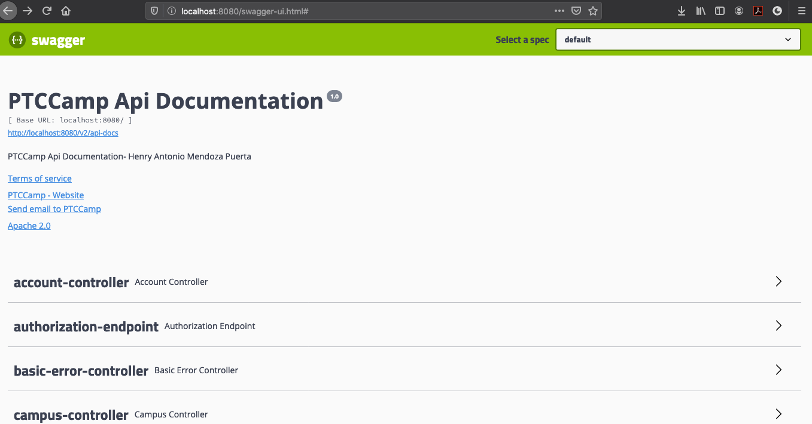

## PTCamp 🚀

Proyecto para gestión de procesos de dirección académica.

* Presencia Académica.
* Disciplinario.

## Construido con 🛠️

Las herramientas que se han usado para construir el proyecto fueron:

### Backend

* [Spring Boot](https://spring.io/projects/spring-boot) - Spring Boot
* [Spring Data JPA](https://spring.io/projects/spring-data-jpa) - Spring Data JPA
* [oAuth2](https://oauth.net/2/) - oAuth2
* [JSON Web Tokens](https://jwt.io/) - JWT

### Frontend
* [Angular](https://angular.io/) - Angular
* [Angular CLI](https://cli.angular.io/) - Angular CLI
* [Node](https://nodejs.org/es/) -Node
* [Boostrap](https://getbootstrap.com/) -Boostrap

## Autor ✒️

Por el momento yo soy el unico autor :D

* **Henry Antonio Mendoza Puerta** -  [hamp](https://www.linkedin.com/in/henrymendozapuerta)

